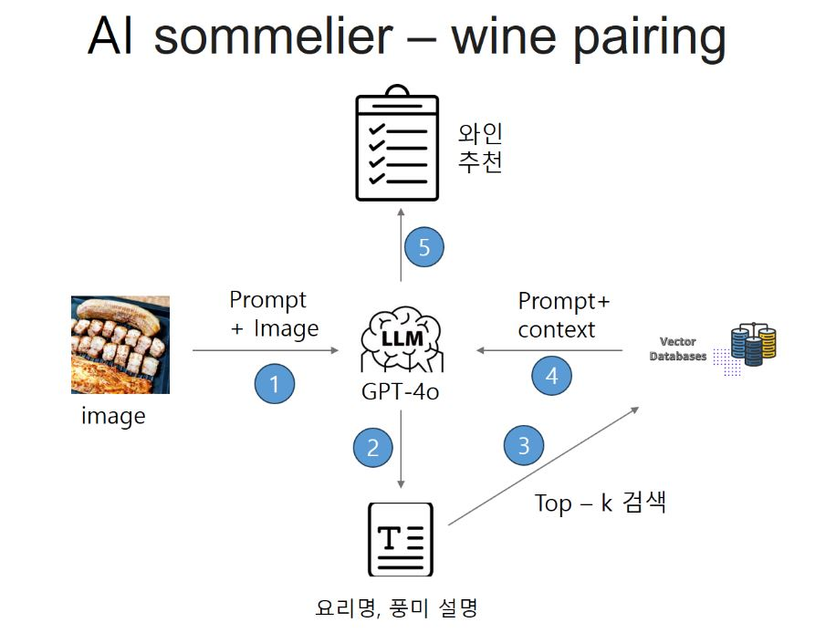

# langchain_rag
langchain RAG 실습

# AI 기반 와인 페어링 추천 서비스

LangChain, FastAPI, OpenAI, Pinecone을 활용한 이미지 기반 와인 추천 백엔드 프로젝트입니다.

---

## 주요 기능

 
- 음식 이미지 기반 풍미 요약
- 유사한 풍미의 와인 리뷰 검색
- 최종 추천 와인 JSON 형태로 응답
- FastAPI 기반 API 서버 제공

---

## 기술 스택

- **FastAPI** – Python 비동기 웹 프레임워크
- **LangChain** – LLM 체인 구성 및 흐름 처리
- **OpenAI GPT-4o** – 텍스트 생성 및 풍미 해석
- **Pinecone** – 벡터 DB 기반 유사 문서 검색
- **Dotenv** – 환경 변수 관리

---

## 설치 라이브러리 
```
pip install -qU python-dotenv
pip install -qU langchain langchain-community langchain-openai

pip install -qU pinecone-client langchain-pinecone
pip install -qU pandas matplotlib tqdm ipywidgets
pip install -r requirements.txt
```

## API 예시
### POST /recommend
``` 
{
  "image_urls": [
    "https://example.com/food_image.jpg"
  ]
}
```

### 응답 
```
{
  "wine_name": "샤르도네",
  "reason": "버터리하고 산뜻한 풍미가 크림 파스타와 잘 어울립니다."
}
```